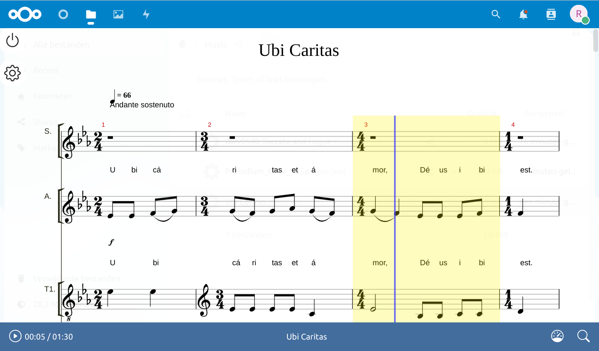

# Nextcloud MusicXML Player

This app allows you to play `*.musicxml` files inside your browser:

Rendering of the music notation and playing the notes is done by the amazing
[alphaTab](https://www.alphatab.net/).

## Info

Tested with:

*  Nextcloud 25
*  PHP 7.4
*  Chrome 110

## Installation

1.  Fetch the `.zip` or `.tar.gz` archive from the
   [latest release](multiplenoise/nextcloud-musicxmlplayer/releases/latest).
1.  Copy the contents of the archive to your Nextcloud's `apps/` folder.
1.  Navigate to "+ Apps", then "Disabled apps" and enable the MusicXMLPlayer app.
